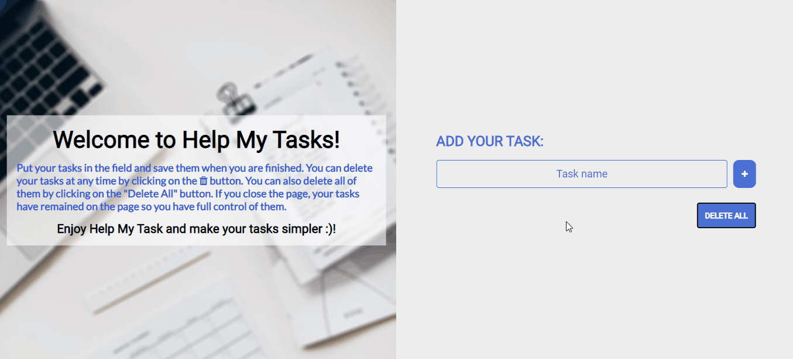
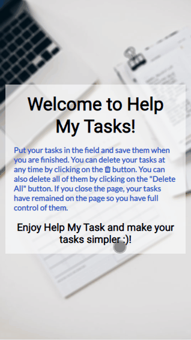

<h1 align="center"><strong>HELP MY TASKS ✔</strong></h1>

<h2><strong>Status:</strong> Finished ✔️</h2>

### In this project I developed the "Help My Tasks". Help My Tasks is a task organizer. With it you can place your tasks and organize them according to your needs. This project was proposed in order to increase my knowledge of <strong>JSON</strong> and <strong>LocalStorage</strong> in JavaScript.

 

     
          
    

 

## **🚀 Technologies:**

 

 ✅ HTML

 ✅ CSS

 ✅ JAVASCRIPT

 

## 💻 Click on [Help My Tasks](https://help-my-tasks.netlify.app), and make your tasks simpler! 😀

 

### Thanks for reading so far. if you want to contact me, feel free to send me a message or send a connection request on my [linkedIn](https://www.linkedin.com/in/mateus-silva-folego260601/) ❤!

 

<h2 align="center"> 📖 Always remember you`re <strong>NEVER</strong> alone!